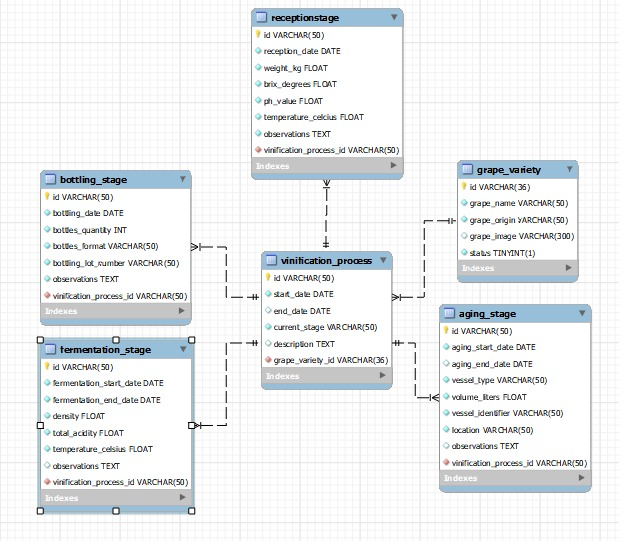

**Winery Management: Complete Control of the Winemaking Process** 

This full-stack API allows you to manage and optimize every stage of the winemaking process, from grape reception to final bottling. Designed for modern wineries, it offers unprecedented visibility and control over your operations

▶️ **Instructions to Run the Project**
1. _Clone the repository:_

`git clone https://github.com/tu-usuario/tu-repo.git`

2. _Create a virtual environment:_

  On Windows:

`python -m venv <environment_name>`

  On Linux/macOS:

`python3 -m venv <environment_name>`

3. _Activate the virtual environment:_

  On Windows:

`<environment_name>\Scripts\activate`

  On Linux / macOS:

`source <environment_name>/bin/activate`

4. _Install dependencies:_

On Windows, Linux, and macOS:

`pip install -r requirements.txt`

5. _Run the application:_

`python3 -m venv <nombre_del_entorno` 

📜 **Class Diagram**

🧑‍💻 **Team Members and Contributions**

_Ledesma Ruben and Espinosa Rodrigo, front-end developers, included sections for better page navigation and included filters to speed up searches in some sections._

_Romano Santiago and Puebla Santiago, developers of BACKEND, which includes routes, models, and a database._

🛠️ **Technologies and Tools Used**

▫️_Flask_ 🔥

▫️ _MySQL_ 🐬

▫️ _MySQL Workbench_ 🧰

▫️ _Git & GitHub_ 🔧

▫️ _HTML_ 🌐

▫️ _CSS_ 🎨

▫️ _Jinja2_ ⛩️

▫️ _Bootstrap_ 💻
